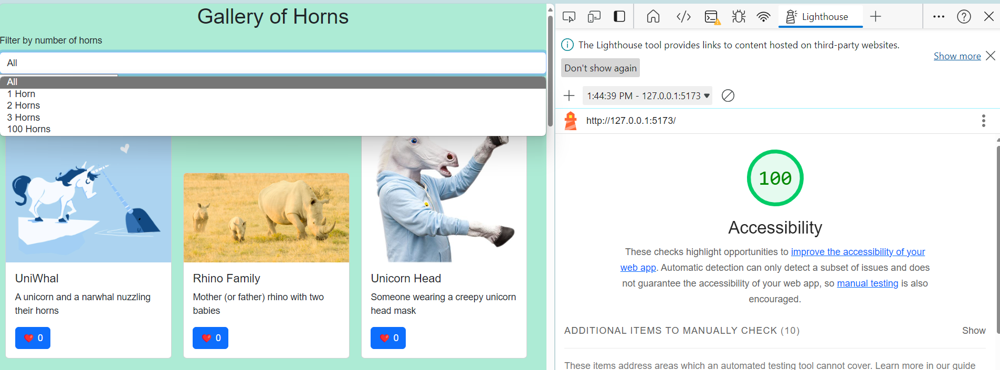

# Gallery-of-Horns

## 3/28 - Class 4, Lab 4

### Feature #1: Display a Modal
- **Estimate of time needed to complete:** 1 hr
- **Actual time needed to complete:** 1 hr
- **Lighthouse Score:**

## 3/27 - Class 3, Lab 3

### Feature #1: Display a Modal
- **Estimate of time needed to complete:** 40 mins
- **Actual time needed to complete:** 50 mins

### Stretch Goal: Fuzzy Search
- **Estimate of time needed to complete:** 50 mins
- **Actual time needed to complete:** 50 mins
- **Lighthouse Score:**

## 3/26 - Class 2, Lab 2

### Feature 1: Display Images
- **Estimate of time needed to complete:** 50 mins
- **Actual time needed to complete:** 15 mins

### Feature 2: Favorite Individual Beasts
- **Estimate of time needed to complete:** 30 mins
- **Actual time needed to complete:** 25 mins

### Feature 3: Bootstrap
- **Estimate of time needed to complete:** 40 mins
- **Actual time needed to complete:** 1 hr
- **Lighthouse Score:**

## 3/25 - Accessibility for Lab 1
- **Lighthouse Score:**

