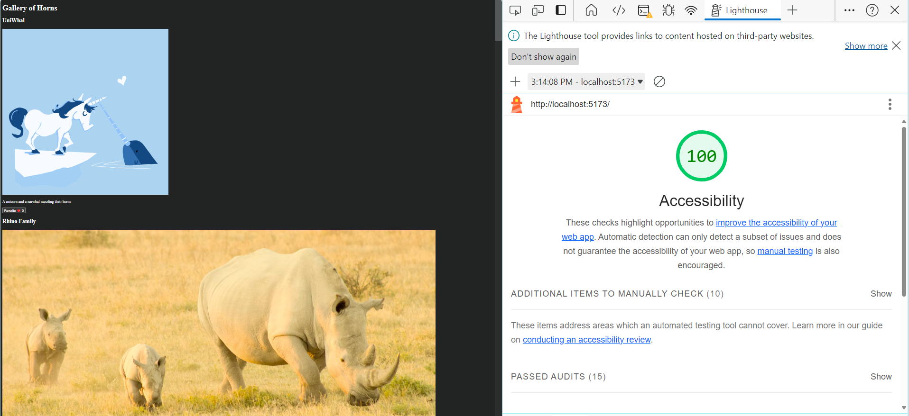

# React + Vite

This template provides a minimal setup to get React working in Vite with HMR and some ESLint rules.

Currently, two official plugins are available:

- [@vitejs/plugin-react](https://github.com/vitejs/vite-plugin-react/blob/main/packages/plugin-react/README.md) uses [Babel](https://babeljs.io/) for Fast Refresh
- [@vitejs/plugin-react-swc](https://github.com/vitejs/vite-plugin-react-swc) uses [SWC](https://swc.rs/) for Fast Refresh
# Gallery-of-Horns

3/27 class 3,lab3:

Feature #1: Display a Modal

Estimate of time needed to complete: __40 mins___

Actual time needed to complete: _50_mins___ ;

Stretch Goal: Fuzzy search

Estimate of time needed to complete: __50 mins___

Actual time needed to complete: __50 mins___
lighthouse score:

3/26 class 2, lab2 :
Feature 1 Display images : estimated time needed to complete: 50 mins, actual time :15 mis; 
Feature 2 Favorite individual beasts: estimated time needed to complete: 30 mins, actual time :25mis;
 Feature 3: Bootstrap: estimated time needed to complete: 40mins, actual time :1 hr;
lighthouse score: 

3/25
Accessibility for lab 1:
